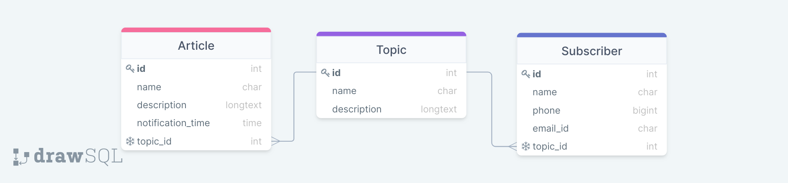

# NewsLetter
### Table of contents
* [General info](#general-info)
* [Functionalities](#functionalities)
* [Technologies](#technologies)
* [ER DIAGRAM](#er-diagram)

### General info
NewsLetter webapp is a an app or a service which will send pre-decided content to a specific set of users[subscriber] at specified intervals/time. 
___

### Functionalities
* Gmail SMTP based html email feature

* Celery-beat + redis based periodictask scheduler

* CRUD APIs for all tables

* API to get article/content by topic

___

### Technologies
* Django
* Django Rest Framework
* SQLite Database
* Djange-celery-beat
* HTML
* GMAIL SMTP
* Redis

The application is almost entirely built using django rest framework.
___

### ER DIAGRAM

There are two more table CrontabSchedule and PeriodicTask, but they are internally built by celery-beat.(So, I didn't include them in ER)

